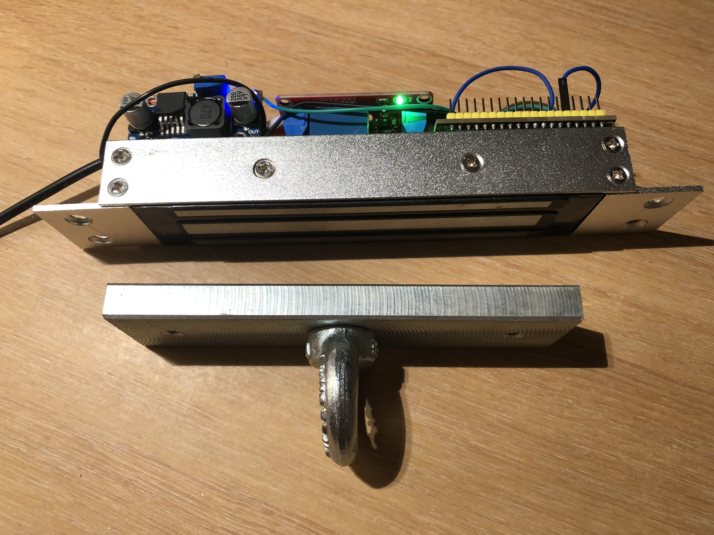
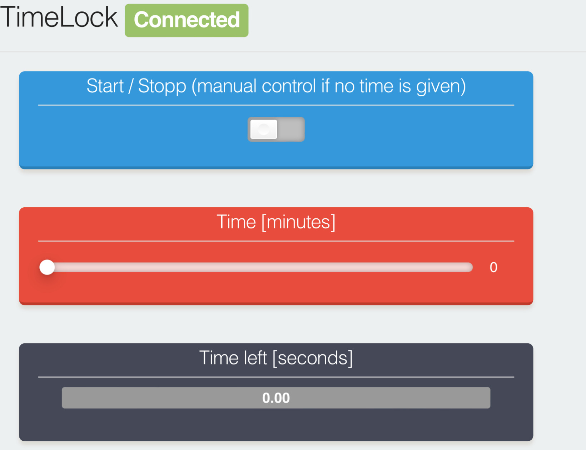
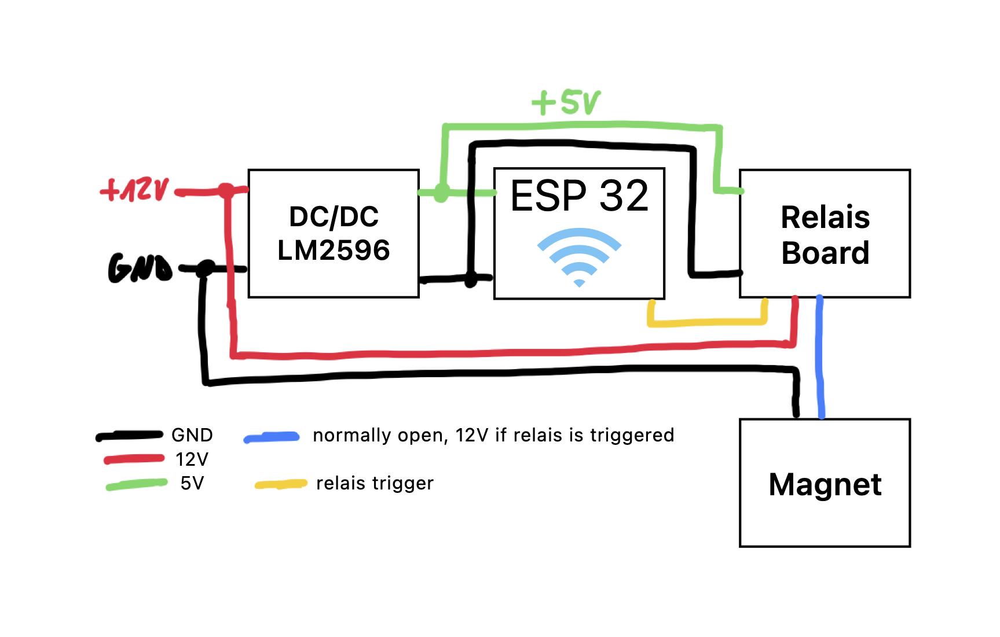

# timeLock

Web-supported magnetic lock for (self-)bondage. Over a web-gui, the user can choose permanent activation or a time-limited activation of a magnet and therefore a locking possibility. The magnet can be turned off at any time and easily mounted due through a low package size.

## Usage

To use the device, the user has to connect to the wifi network which is enabled by the ESP32-MCU. The credentials can be specified at the source code. 
With adressing the embedded webserver through the hardcoded IP-address of the MCU, the user is able to set controls as shown in the figure. The start/stopp switch is non-blocking, therefore the magnet can be turned off by the user at every time, even if there is a rest of time left. If the start/stopp switch is toggeled to start with a time set to 0, permanent activation is done. The time left label turns to infinity.

## How to build
### Hardware

To build the device, it is recommended to use prefabricated modules from the "Maker" shelf. As you can see in the picture above, the device consists of 4 different modules: A DC/DC converter that converts the voltage from +12V to +5V for the ESP32 and the relais board, an ESP32 (here: DevKitC), a standard relais board with one channel ([amazon example](https://www.amazon.de/gp/product/B07XY2C5M5/ref=ppx_yo_dt_b_asin_title_o02_s04?ie=UTF8&psc=1)) and the magnet itself ([amazon example](https://www.amazon.de/gp/product/B08NCYPHH7/ref=ppx_yo_dt_b_asin_title_o02_s02?ie=UTF8&psc=1)). The challenge with the hardware setup is to keep the package size as small as possible if desired. Hot glue is our friend here.

The magnet which was choosen for the actual design was one with +12V and 180kg holding force. This was given in the datasheet - even if I would not be suprised if the force would be less under some real tests. Nevertheless, for bounding purpose the holding force is absolutly enough.

The +12V of the magnet should be connected to the NO (normally open) port of the relais in order to ensure that the magnet is turned off if no trigger from the user is set up. 

The trigger signal will be emitted from a pin (standard G2, tuneable in the source code) of the ESP3.

### Software
This repository is a Platformio project and as such can be transferred directly to the microcontroller. The web GUI is largely based on the ESPUI library (a bin thanks to the people behind this!) and can be easily extended. In the standard settings, timers up to 3 hours are possible - but this can be changed at any time. 

The opened wifi network can also be customized in the source code. 

## Please note!
Attention: Always play safe! Only use the device for a safe duration and under safe conditions! Test your device thoroughly before using it on people! Building and using is on your own risk!
